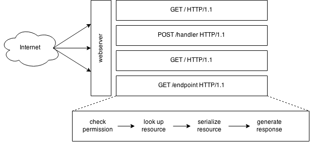

# Web Application Concurrency

*Especially in Python*

This repository contains a bunch of code that I'm in the process of
annotating that demonstrates different approaches to concurrency in web
applications.

It's under the Apache 2 license but is heavily contrived and not
intended for purposes beyond demonstration.

## What's in this repo?

### The application

The example application, implemented many times here, includes at least
two endpoints: one which acts as an HTTP proxy, making an HTTP request
to a "slow" upstream (see ``sleepserver.go``); and one which makes a
non-HTTP network connection to a "slow" cache server (see
``memcache.go``).

TODO: Add a CPU-bound endpoint.

Some examples may include framework- or language-specific variations.

### The files

The examples:

- ``flask_proxy.py`` - the application implemented in Python with
  [Flask](http://flask.pocoo.org/docs/0.10/), to be run with gunicorn.
- ``nproxy.js`` - the application implemented in
  [Node.js](http://nodejs.org/), using callbacks.
- ``proxy.go`` - the application implemented in
  [Go](http://golang.org/).
- ``tornado_proxy.py`` - the application implemented in Python with
  [Tornado](http://tornado.readthedocs.org/), in old and new styles, and
  a "don't" example.

Support files:

- ``memcache.go`` - run the "slow" cache server with `go run
  memcache.go`
- ``package.json`` - install the node dependencies with `npm install`
- ``requirements.txt`` - install the python dependencies with `pip
  install -r requirements.txt`
- ``sleepserver.go`` - run the "slow" upstream with `go run
  sleepserver.go`

## What is concurrency?

[Rob Pike's
talk](https://blog.golang.org/concurrency-is-not-parallelism) at Heroku
is the best resource I've seen. Go watch it. To paraphrase:

- **Concurrency** is programming as the composition of independently
  executing processes (not "processes" as in computer language, but more
  their more lay/common definition, notoriously hard to define).
- **Parallelism** is the simultaneous execution of (possibly related)
  computations.
- **Concurrency** is about structure or design.
- **Parallelism** is about execution.
- Concurrency provides a way to structure a solution that **may**
  enable parallelism.

To dive directly into the domain of web applications: *individual
requests to a web server are independent "processes," and thus are
highly concurrent by their very nature*.

## Hardware limitations

Each CPU core can do exactly one thing (usually executing a single
thread) at a time. There are two ways to implement multitasking on a
single core:

- Pre-emptive multitasking, in which the computer switches between
  multiple threads, either periodically or in response to an interrupt.
- Cooperative multitasking, in which a running process *yields* control.

### Pre-emptive multitasking

Pre-emptive multitasking is comparatively expensive, because execution
state must be saved and restored, a process that involves moving between
user and kernel space. Computers are doing this sort of multitasking
constantly, which can be measured by looking at *context switches*.

Examples:

- Responding to mouse and keyboard input while playing a video.
- Running two processes on a single-core machine.

### Co-operative multitasking

Cooperative multitasking is more commonly used *within* a user-space
thread, so it doesn't require the relatively expensive context switching
operating. Cooperative multitasking is a great tool when a program knows
it will be executing many concurrent tasks that spend a high percentage
of their time waiting on external resources (I/O bound).

Examples:

- Goroutines.
- Coroutines.

## Concurrent web requests



Because HTTP is a "stateless" protocol, individual requests are,
usually, unrelated to each other. They are "independently executing
processes."

Consider an application that generates a list of articles for a logged
in user.  This application may look something like this:

```python
for each request:
    session_id = request.COOKIE['session']
    if not session_id or not valid session_id:
        return 302 /login/

    current_user = look up session_id
    articles = look up articles for current_user

    template = 'home_page.html'
    html = render(template, current_user, articles)
    write response (html)
```

The simplest way to run this application is to execute it once for every
request that comes in, and when it's done, move on to the next request.
